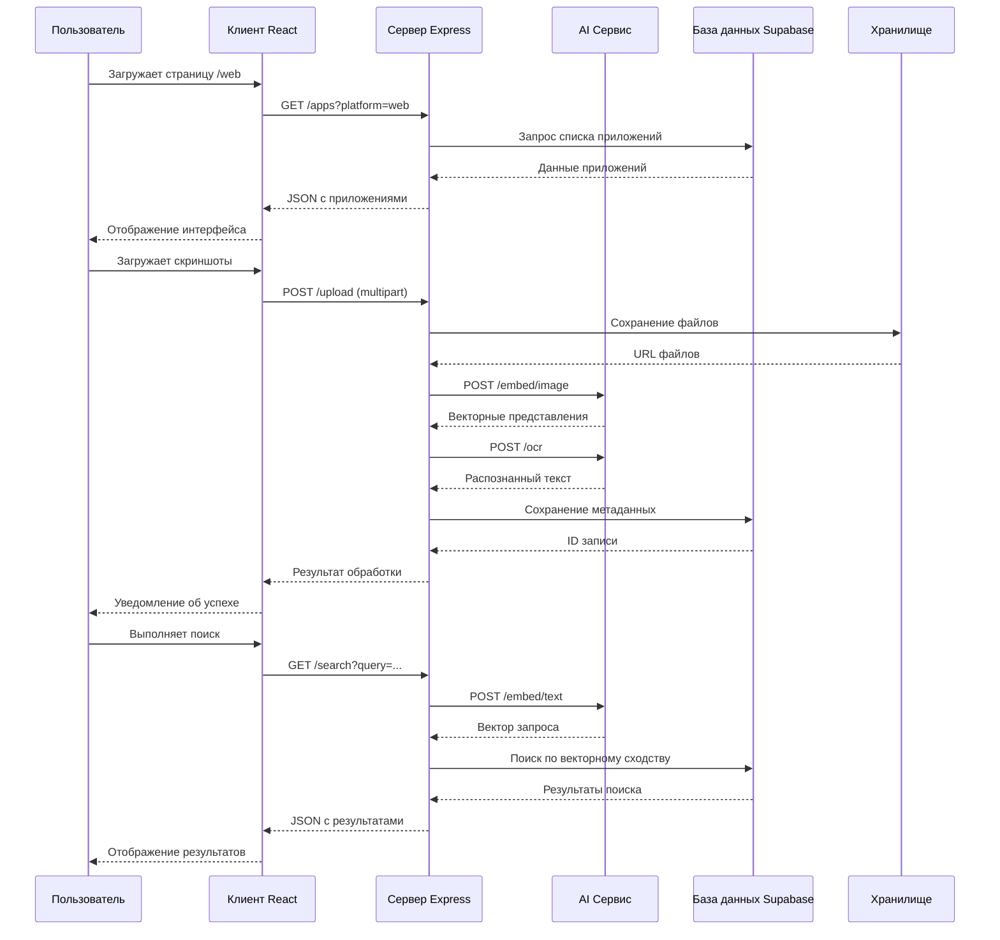

# Архитектура системы для дипломной работы

## Визуальная схема архитектуры

```mermaid
graph TB
    %% Основные компоненты
    User[Пользователь] --> Client[Клиент React<br/>Порт: 5173]
    
    subgraph "Фронтенд слой"
        Client --> FrontendServices[Сервисы фронтенда]
        FrontendServices --> Routing[Маршрутизация]
        FrontendServices --> UIComponents[UI компоненты]
        FrontendServices --> StateManagement[Управление состоянием]
    end
    
    Client --> API[API запросы]
    
    subgraph "Бэкенд слой"
        API --> Server[Сервер Express.js<br/>Порт: 3000]
        
        Server --> BusinessLogic[Бизнес-логика]
        BusinessLogic --> AppManagement[Управление приложениями]
        BusinessLogic --> FileProcessing[Обработка файлов]
        BusinessLogic --> DataAggregation[Агрегация данных]
        
        Server --> SecurityLayer[Слой безопасности]
        SecurityLayer --> CORS[CORS политики]
        SecurityLayer --> SupabaseAuth[Supabase-аутентификация]
        SecurityLayer --> RequestValidation[Валидация запросов]
    end
    
    subgraph "AI слой"
        Server --> AIService[AI Сервис Python/Flask<br/>Порт: 5000]
        
        AIService --> AIProcessing[AI обработка]
        AIProcessing --> VectorEmbeddings[Векторные представления]
        AIProcessing --> TextRecognition[Распознавание текста]
        AIProcessing --> SemanticAnalysis[Семантический анализ]
    end
    
    subgraph "Слой данных"
        Server --> Database[База данных Supabase]
        Database --> StructuredData[Структурированные данные]
        StructuredData --> AppData[Данные приложений]
        StructuredData --> UserData[Пользовательские данные]
        StructuredData --> Metadata[Метаданные]
        
        Server --> FileStorage[Хранилище файлов]
        FileStorage --> Images[Изображения]
        FileStorage --> Screenshots[Скриншоты]
        
        Server --> AuthInfrastructure[Аутентификация]
        AuthInfrastructure --> JWTManagement[Управление JWT]
        AuthInfrastructure --> UserSessions[Пользовательские сессии]
    end
    
    %% Взаимодействия
    Client -.->|HTTP/REST| Server
    Server -.->|REST API| AIService
    Server -.->|Supabase Client| Database
    Server -.->|Supabase Storage| FileStorage
    Client -.->|Supabase JS| AuthInfrastructure
    
    %% Стилизация
    classDef frontend fill:#e1f5fe,stroke:#01579b
    classDef backend fill:#f3e5f5,stroke:#4a148c
    classDef ai fill:#e8f5e8,stroke:#1b5e20
    classDef data fill:#fff3e0,stroke:#e65100
    
    class Client,FrontendServices,Routing,UIComponents,StateManagement frontend
    class Server,BusinessLogic,SecurityLayer backend
    class AIService,AIProcessing,VectorEmbeddings,TextRecognition,SemanticAnalysis ai
    class Database,FileStorage,AuthInfrastructure,StructuredData data
```



## Обзор системы
Система представляет собой интеллектуальное веб-приложение для проведения конкурентного анализа интерфейсов программного обеспечения. Архитектура построена по принципу микросервисов с разделением на три основных компонента: клиент (React), сервер (Node.js/Express) и AI-сервис (Python/Flask).

## Компоненты системы

### 1. Клиентская часть (Frontend)
**Технологии:** React 18, Vite, React Router, Supabase Auth
**Порт:** 5173

#### Структура клиента:
```
client/
├── src/
│   ├── components/          # React компоненты
│   │   ├── AppCard.jsx     # Карточка приложения
│   │   ├── AuthModal.jsx   # Модальное окно аутентификации
│   │   ├── ImageUploadModal.jsx # Загрузка скриншотов
│   │   ├── NavBar.jsx      # Навигационная панель
│   │   ├── SearchModal.jsx # Модальное окно поиска
│   │   ├── SegmentBox.jsx  # Компонент сегментации
│   │   └── Tag.jsx         # Компонент тегов
│   ├── pages/              # Страницы приложения
│   │   ├── Home.jsx        # Главная страница
│   │   ├── AppDetail.jsx   # Детальная страница приложения
│   │   ├── Search.jsx      # Страница поиска
│   │   └── Profile.jsx     # Страница профиля
│   ├── contexts/           # React контексты
│   │   ├── AuthContext.jsx # Контекст аутентификации
│   │   └── ProtectedRoute.jsx # Защищённые маршруты
│   ├── lib/                # Клиентские библиотеки
│   │   └── supabaseClient.js # Клиент Supabase
│   └── utils/              # Вспомогательные функции
│       ├── tagNavigation.js # Навигация по тегам
│       ├── collectionUtils.js # Утилиты коллекций
│       └── exportScreenshots.js # Экспорт скриншотов
```

#### Маршрутизация:
- `/` → `/web` (редирект)
- `/web`, `/web/:category` → Главная страница для веб-приложений
- `/ios`, `/ios/:category` → Главная страница для iOS приложений
- `/app/:id` → Детальная страница приложения
- `/search` → Страница поиска
- `/profile` → Защищённая страница профиля

### 2. Серверная часть (Backend)
**Технологии:** Node.js, Express, Multer, CORS
**Порт:** 3000

#### Основные эндпоинты:
- `GET /apps` - Получение списка приложений с фильтрацией по платформе
- `GET /apps/:id` - Получение детальной информации о приложении
- `POST /upload` - Загрузка скриншотов для анализа
- `GET /categories` - Получение списка категорий
- `GET /platforms` - Получение списка платформ

#### Интеграции:
- **Supabase Database** - Основное хранилище данных
- **AI Service** - Обработка изображений и текста через CLIP модель
- **Supabase Auth** - Аутентификация пользователей

### 3. AI-сервис (AI Service)
**Технологии:** Python, Flask, CLIP (OpenAI), Tesseract OCR
**Порт:** 5000

#### Функциональность:
- **Текстовая эмбеддинг** - Преобразование текста в векторные представления
- **Визуальная эмбеддинг** - Анализ изображений и скриншотов
- **OCR распознавание** - Извлечение текста из изображений
- **Семантический поиск** - Поиск по сходству векторов

#### Эндпоинты AI-сервиса:
- `POST /embed/text` - Генерация векторного представления текста
- `POST /embed/image` - Генерация векторного представления изображения
- `POST /ocr` - Распознавание текста на изображении
- `POST /similarity` - Поиск семантически похожих элементов

### 4. База данных (Supabase)
**Технологии:** PostgreSQL, Row Level Security, Storage

#### Основные таблицы:
- `apps` - Основная информация о приложениях
- `screenshots` - Скриншоты интерфейсов
- `platforms` - Платформы (web, ios, android)
- `categories` - Категории приложений
- `app_platforms` - Связь приложений с платформами
- `app_categories` - Связь приложений с категориями
- `users` - Пользовательские данные (через Supabase Auth)
- `collections` - Пользовательские коллекции

### 5. Внешние сервисы
- **Supabase** - База данных, аутентификация, хранилище файлов
- **Tesseract OCR** - Распознавание текста на изображениях
- **CLIP Model** - Модель для семантического анализа изображений и текста

## Поток данных

1. **Пользовательский интерфейс** → Клиент обрабатывает действия пользователя
2. **API запросы** → Клиент отправляет запросы на сервер (порт 3000)
3. **Обработка данных** → Сервер взаимодействует с Supabase и AI-сервисом
4. **AI обработка** → Сервер делегирует сложные задачи AI-сервису (порт 5000)
5. **Хранение данных** → Supabase сохраняет структурированные данные
6. **Ответ пользователю** → Результаты возвращаются через цепочку обратно

## Особенности архитектуры

### Масштабируемость:
- Разделение ответственности между компонентами
- Независимое масштабирование AI-сервиса при высокой нагрузке
- Использование облачной БД (Supabase) для горизонтального масштабирования

### Безопасность:
- JWT аутентификация через Supabase Auth
- Row Level Security в базе данных
- CORS политики для защиты API
- Валидация входных данных на всех уровнях

### Производительность:
- Кэширование часто запрашиваемых данных
- Асинхронная обработка тяжелых операций (OCR, эмбеддинг)
- Оптимизированные запросы к базе данных с индексами

## Требования к инфраструктуре

### Локальная разработка:
- Node.js 18+ для сервера и клиента
- Python 3.8+ для AI-сервиса
- Tesseract OCR для обработки изображений
- Доступ к интернету для загрузки моделей CLIP

### Продакшен:
- Выделенные инстансы для каждого сервиса
- Балансировщик нагрузки для распределения трафика
- Мониторинг и логирование
- Резервное копирование базы данных

## Поток данных через систему



## Направления развития архитектуры

1. **Добавление очереди задач** - Для асинхронной обработки больших объёмов данных
2. **Кэширующий слой** - Redis для ускорения частых запросов
3. **Микросервис аналитики** - Отдельный сервис для сбора метрик
4. **CI/CD пайплайн** - Автоматизация развёртывания
5. **Контейнеризация** - Docker для изоляции сервисов

## Заключение

Представленная архитектура обеспечивает:
- **Модульность** - Каждый компонент выполняет чётко определённую функцию
- **Масштабируемость** - Возможность независимого масштабирования компонентов
- **Поддержку AI/ML** - Интеграция современных моделей машинного обучения
- **Безопасность** - Многоуровневая система защиты данных
- **Производительность** - Оптимизированные потоки данных и кэширование

Архитектура соответствует требованиям дипломной работы по созданию интеллектуальной системы для конкурентного анализа интерфейсов ПО и предоставляет основу для дальнейшего развития проекта.