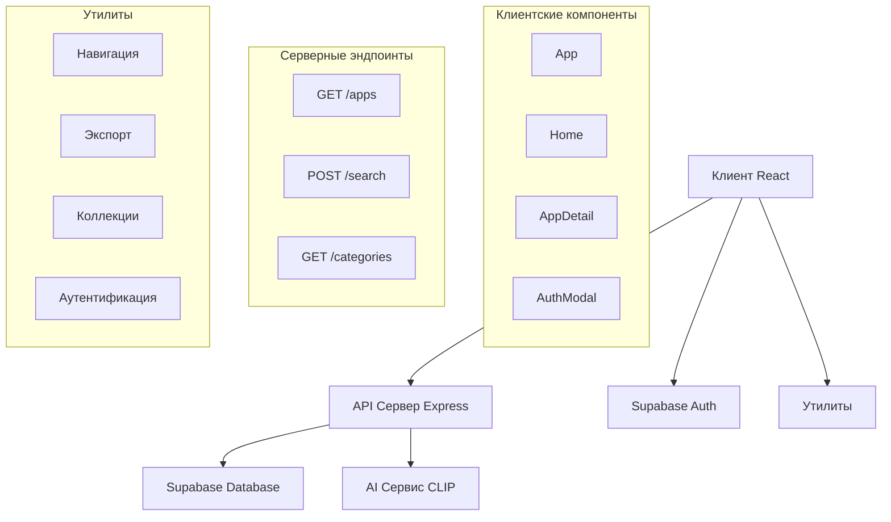
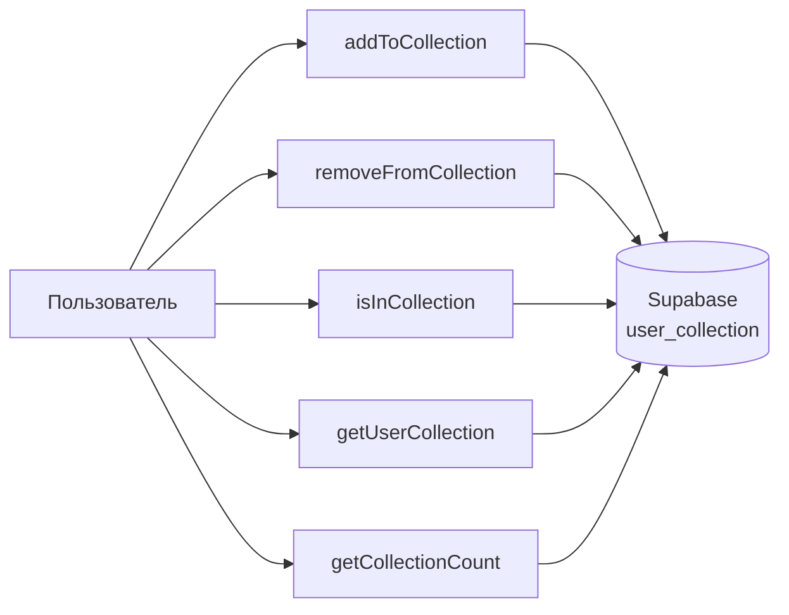
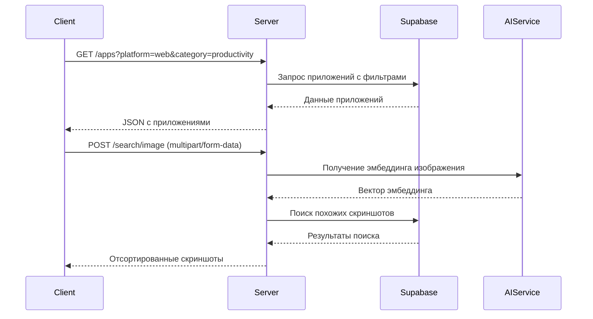
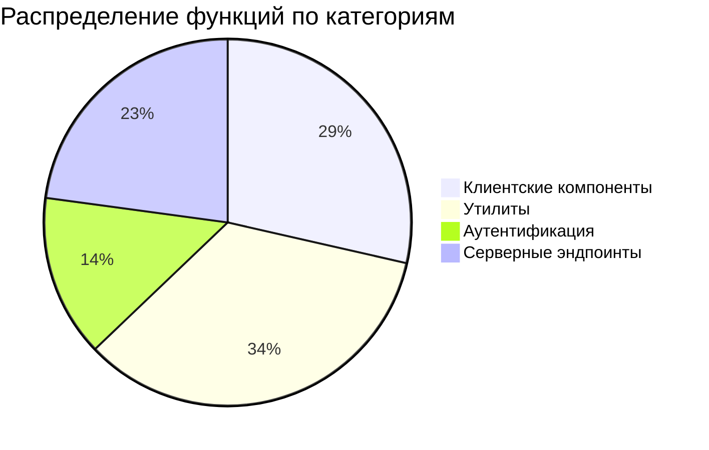
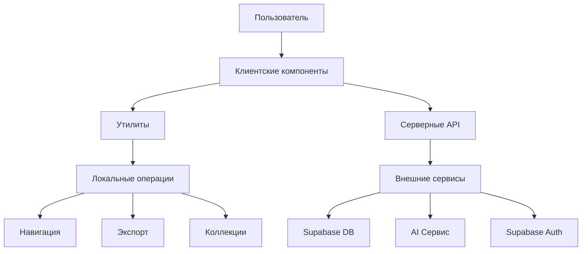
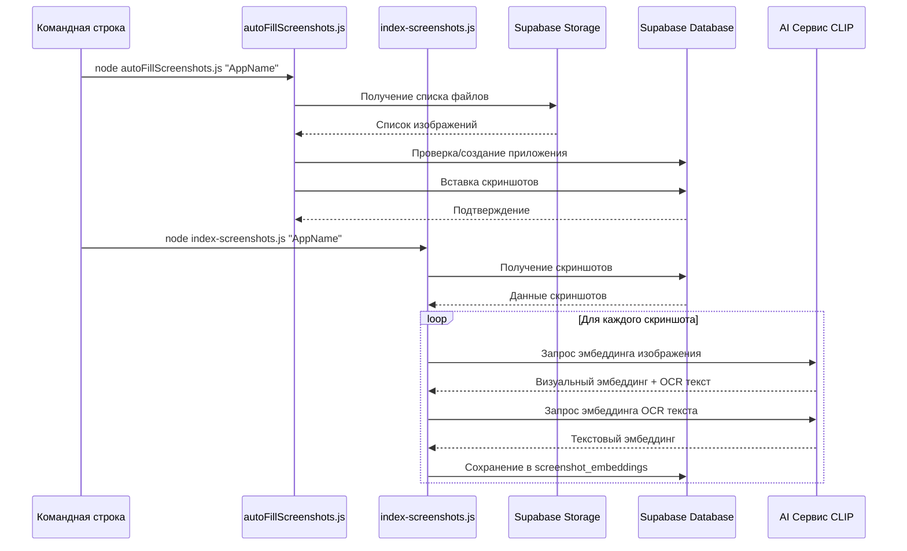

# Документация функций программы "Каталог приложений"

## 📋 Обзор системы

Программа представляет собой веб-приложение для каталогизации приложений с функциями визуального поиска, управления коллекциями и экспорта данных. Система состоит из клиентской части (React), серверной части (Express.js) и утилитарных модулей.

## 🏗️ Архитектура системы



## 📱 Клиентские компоненты (React)

### 1. Главный компонент приложения

**`App()`** - [`client/src/App.jsx:10`](client/src/App.jsx:10)
- **Назначение**: Главный компонент приложения, определяет маршрутизацию
- **Параметры**: Нет
- **Возвращает**: JSX с маршрутизацией React Router
- **Маршруты**:
  - `/` → `/web` (редирект)
  - `/web`, `/web/:category` → Home с платформой "web"
  - `/ios`, `/ios/:category` → Home с платформой "ios"
  - `/app/:id` → AppDetail
  - `/search` → Search
  - `/profile` → Profile (защищенный маршрут)

### 2. Компонент главной страницы

**`Home({ platformSlug, title })`** - [`client/src/pages/Home.jsx:8`](client/src/pages/Home.jsx:8)
- **Назначение**: Отображение списка приложений с бесконечной прокруткой
- **Параметры**:
  - `platformSlug` (string): Идентификатор платформы ('web', 'ios')
  - `title` (string): Заголовок страницы
- **Внутренние функции**:
  - `fetchCategories()`: Асинхронная загрузка категорий из API
  - `fetchApps(pageNum, append)`: Загрузка приложений с пагинацией
  - `handleCategoryChange(slug)`: Обработка смены категории с навигацией

### 3. Детальная страница приложения

**`AppDetail()`** - [`client/src/pages/AppDetail.jsx:9`](client/src/pages/AppDetail.jsx:9)
- **Назначение**: Отображение детальной информации о приложении
- **Внутренние функции**:
  - `fetchApp()`: Загрузка данных приложения по ID
  - `handleExport()`: Экспорт скриншотов в ZIP-архив
  - `LazyImage({ src, alt, onClick })`: Компонент ленивой загрузки изображений

### 4. Модальное окно аутентификации

**`AuthModal({ onClose })`** - [`client/src/components/AuthModal.jsx:5`](client/src/components/AuthModal.jsx:5)
- **Назначение**: Модальное окно для входа/регистрации по email
- **Параметры**:
  - `onClose` (function): Функция закрытия модального окна
- **Внутренние функции**:
  - `handleEmailSubmit(e)`: Обработка отправки email для OTP

## 🔧 Утилитарные функции

### Навигация по тегам - [`client/src/utils/tagNavigation.js`](client/src/utils/tagNavigation.js)

| Функция | Параметры | Возвращает | Назначение |
|---------|-----------|------------|------------|
| `getPlatformSlug(app)` | `app` (object) | string | Получает slug платформы из данных приложения |
| `getCategorySlug(app)` | `app` (object) | string/null | Получает slug категории из данных приложения |
| `getPlatformUrl(platformData)` | `platformData` (object) | string | Генерирует URL для тега платформы |
| `getCategoryUrl(app, categoryData)` | `app` (object), `categoryData` (object) | string | Генерирует URL для тега категории |
| `getTagUrl(app, type, data)` | `app` (object), `type` (string), `data` (object) | string | Генерирует URL для тега на основе типа |

### Экспорт скриншотов - [`client/src/utils/exportScreenshots.js`](client/src/utils/exportScreenshots.js)

**`exportScreenshotsToZip(screenshots, appName)`** - строка 10
- **Назначение**: Экспортирует скриншоты в ZIP-архив
- **Параметры**:
  - `screenshots` (array): Массив объектов скриншотов с `image_url`
  - `appName` (string): Название приложения для имени файла
- **Возвращает**: Promise<void>
- **Алгоритм**:
  1. Создает ZIP-архив с папкой "screenshots"
  2. Загружает каждый скриншот по URL
  3. Сохраняет с именами `screenshot_{index}_{sort_order}.{extension}`
  4. Генерирует и скачивает архив

**`exportScreenshotsWithProgress(screenshots, appName, onProgress)`** - строка 57
- **Назначение**: Экспорт скриншотов с отслеживанием прогресса
- **Дополнительный параметр**: `onProgress(completed, total)` - callback для прогресса

### Управление коллекцией - [`client/src/utils/collectionUtils.js`](client/src/utils/collectionUtils.js)



| Функция | Параметры | Возвращает | Назначение |
|---------|-----------|------------|------------|
| `addToCollection(screenshotId, appId, userId)` | `screenshotId`, `appId`, `userId` (string) | `{success, error?}` | Добавляет скриншот в коллекцию пользователя |
| `removeFromCollection(screenshotId, userId)` | `screenshotId`, `userId` (string) | `{success, error?}` | Удаляет скриншот из коллекции |
| `isInCollection(screenshotId, userId)` | `screenshotId`, `userId` (string) | boolean | Проверяет наличие скриншота в коллекции |
| `getUserCollection(userId)` | `userId` (string) | array | Получает все скриншоты из коллекции |
| `getCollectionCount(userId)` | `userId` (string) | number | Получает количество скриншотов в коллекции |

## 🔐 Аутентификация - [`client/src/contexts/AuthContext.jsx`](client/src/contexts/AuthContext.jsx)

**`ensurePublicUser(user)`** - строка 12
- **Назначение**: Создает/обновляет пользователя в таблице public.users
- **Параметры**: `user` (object) - объект пользователя из Supabase Auth
- **Алгоритм**: Использует upsert для создания или обновления записи

**`signUpWithOtp(email)`** - строка 69
- **Назначение**: Регистрация по email с OTP
- **Параметры**: `email` (string)
- **Возвращает**: `{success, error?}`

**`signInWithOtp(email)`** - строка 85
- **Назначение**: Вход по email с OTP
- **Параметры**: `email` (string)
- **Возвращает**: `{success, error?}`

**`verifyOtp(email, token)`** - строка 101
- **Назначение**: Верификация OTP кода
- **Параметры**: `email` (string), `token` (string)
- **Возвращает**: `{success, error?}`

**`signOut()`** - строка 116
- **Назначение**: Выход из системы
- **Возвращает**: `{success, error?}`

## 🖥️ Серверные функции (Express API)

### Основные эндпоинты - [`server/server.js`](server/server.js)



### Таблица эндпоинтов

| Метод | Путь | Параметры | Назначение |
|-------|------|-----------|------------|
| `GET` | `/apps` | `platform`, `limit`, `offset`, `category` | Получение списка приложений с фильтрацией |
| `GET` | `/apps/:id` | `id` (path) | Детальная информация об одном приложении |
| `GET` | `/apps/:id/screenshots` | `id` (path) | Скриншоты конкретного приложения |
| `GET` | `/platforms` | Нет | Справочник платформ |
| `GET` | `/categories` | Нет | Справочник категорий |
| `POST` | `/search/image` | `image` (file) | Поиск по изображению (CLIP) |
| `POST` | `/search/text` | `query`, `limit`, `offset` | Поиск по текстовому описанию (CLIP) |
| `GET` | `/search/apps` | `query`, `limit` | Поиск приложений по тексту |

### Детализация поисковых функций

**`POST /search/image`** - строка 155
- **Алгоритм**:
  1. Получение эмбеддинга изображения от AI-сервиса
  2. Гибридный поиск (визуальный + OCR) в Supabase
  3. Фильтрация по порогу similarity (0.45)
  4. Получение данных скриншотов
  5. Сортировка по сходству

**`POST /search/text`** - строка 261
- **Алгоритм**:
  1. Получение эмбеддинга текста от AI-сервиса
  2. Гибридный поиск с весами (visual: 0.6, text: 0.4)
  3. Пагинация и фильтрация
  4. Возврат результатов с метаданными пагинации

## 📊 Сводная статистика

### Распределение функций по категориям



### Ключевые метрики
- **Всего функций**: 35
- **Клиентские компоненты**: 4 основных + 6 внутренних = 10 функций
- **Утилиты**: 12 функций
- **Аутентификация**: 5 функций
- **Серверные эндпоинты**: 8 функций

## 🎯 Функциональные области системы

### 1. Навигация и отображение
- **Функции**: `getPlatformSlug`, `getCategorySlug`, `getPlatformUrl`, `getCategoryUrl`, `getTagUrl`
- **Назначение**: Работа с платформами, категориями, тегами и навигацией

### 2. Поиск и фильтрация
- **Функции**: `fetchApps`, `POST /search/image`, `POST /search/text`, `GET /search/apps`
- **Назначение**: Текстовый и визуальный поиск, пагинация, фильтрация

### 3. Управление коллекцией
- **Функции**: `addToCollection`, `removeFromCollection`, `isInCollection`, `getUserCollection`, `getCollectionCount`
- **Назначение**: Персональная коллекция скриншотов пользователя

### 4. Экспорт данных
- **Функции**: `exportScreenshotsToZip`, `exportScreenshotsWithProgress`, `handleExport`
- **Назначение**: Сохранение скриншотов в ZIP-архив

### 5. Аутентификация и авторизация
- **Функции**: `ensurePublicUser`, `signUpWithOtp`, `signInWithOtp`, `verifyOtp`, `signOut`
- **Назначение**: OTP-авторизация через email, управление сессиями

### 6. API взаимодействие
- **Функции**: Все серверные эндпоинты
- **Назначение**: RESTful API для работы с данными приложений

## 🔗 Взаимосвязи функций



## Индексация скриншотов и занесение в БД

Система включает два ключевых скрипта для работы со скриншотами: автоматическое добавление скриншотов в базу данных и их индексация для визуального поиска.

### 1. Автоматическое добавление скриншотов - [`server/autoFillScreenshots.js`](server/autoFillScreenshots.js)

**`importScreenshots()`** - строка 4
- **Назначение**: Автоматически добавляет скриншоты из Supabase Storage в базу данных
- **Параметры командной строки**: `folderName` - название папки в бакете screenshots
- **Алгоритм**:
  1. Получает название папки из аргументов командной строки
  2. Проверяет существование приложения в таблице `apps`
  3. Создает новое приложение если не существует
  4. Получает список файлов из Supabase Storage
  5. Для каждого изображения:
     - Генерирует публичный URL
     - Проверяет дубликаты в таблице `screenshots`
     - Вставляет запись с `app_id`, `image_url`, `sort_order`

**Ключевые функции**:
- Проверка существования приложения
- Получение файлов из Supabase Storage
- Генерация публичных URL
- Вставка скриншотов с автоматическим порядком

### 2. Индексация скриншотов для поиска - [`server/index-screenshots.js`](server/index-screenshots.js)

**`indexScreenshots()`** - строка 116
- **Назначение**: Создает векторные эмбеддинги скриншотов для визуального поиска
- **Параметры командной строки**: `appNameFilter` (опционально) - фильтр по названию приложения
- **Алгоритм**:
  1. Получение всех скриншотов из БД (с фильтрацией по приложению)
  2. Проверка уже проиндексированных скриншотов
  3. Для каждого нового скриншота:
     - Получение визуального эмбеддинга от AI-сервиса
     - Извлечение и очистка OCR текста
     - Получение текстового эмбеддинга для OCR текста
     - Сохранение в таблицу `screenshot_embeddings`

**Вспомогательные функции**:

**`getAllScreenshots(appName)`** - строка 15
- **Назначение**: Пагинированное получение скриншотов из БД
- **Параметры**: `appName` (string) - фильтр по названию приложения
- **Возвращает**: Массив объектов скриншотов

**`getEmbedding(imageUrl)`** - строка 77
- **Назначение**: Получение визуального эмбеддинга и OCR текста от AI-сервиса
- **Параметры**: `imageUrl` (string) - URL скриншота
- **Возвращает**: `{embedding, ocr_text}` или `null`

**`getTextEmbedding(text)`** - строка 104
- **Назначение**: Получение текстового эмбеддинга для OCR текста
- **Параметры**: `text` (string) - очищенный OCR текст
- **Возвращает**: Вектор эмбеддинга или `null`

**`cleanText(text)`** - строка 68
- **Назначение**: Очистка OCR текста (нижний регистр, удаление спецсимволов)
- **Параметры**: `text` (string) - исходный OCR текст
- **Возвращает**: Очищенный текст

### 3. Архитектура процесса индексации



### 4. Структура данных

**Таблица `screenshots`**:
- `id` - уникальный идентификатор
- `app_id` - ссылка на приложение
- `image_url` - публичный URL скриншота
- `sort_order` - порядок отображения

**Таблица `screenshot_embeddings`**:
- `screenshot_id` - ссылка на скриншот
- `visual_embedding` - вектор визуального эмбеддинга (512+ измерений)
- `ocr_text` - извлеченный текст с изображения
- `ocr_embedding` - вектор текстового эмбеддинга
- `indexed_at` - дата индексации

### 5. Использование

```bash
# 1. Добавление скриншотов в БД
node server/autoFillScreenshots.js "Intercom Web"

# 2. Индексация для поиска (все скриншоты)
node server/index-screenshots.js

# 3. Индексация конкретного приложения
node server/index-screenshots.js "Intercom Web"
```

### 6. Интеграция с поиском

Проиндексированные скриншоты используются в:
- **Визуальном поиске** (`POST /search/image`) - сравнение по `visual_embedding`
- **Текстовом поиске** (`POST /search/text`) - гибридный поиск по `visual_embedding` и `ocr_embedding`
- **Гибридном поиске** - комбинация визуального и текстового сходства

## Заключение

Программа представляет собой полноценное веб-приложение с четким разделением ответственности:
- **Клиентская часть**: Пользовательский интерфейс, навигация, локальные операции
- **Серверная часть**: Бизнес-логика, интеграция с внешними сервисами
- **Утилиты**: Вспомогательные функции для повторного использования

Все функции документированы с указанием расположения в кодовой базе, параметров, возвращаемых значений и назначения, что обеспечивает легкую поддержку и развитие системы.